## 🧠 To-Do CLI App (Python + Click + Rich + Pydantic)

A modern, colorful, and type-safe command-line To-Do manager, built entirely in Python.
Demonstrates clean CLI architecture, modular design, data validation, and professional developer practices.

## 🚀 Features

✅ **CRUD for tasks** — add, list, update, complete, delete  
✅ **Priority levels** (`low`, `medium`, `high`)  
✅ **Due dates** (validated with `Pydantic` + `datetime`)  
✅ **Tags/categories** for better organization  
✅ **Search & filter** tasks by tag, due date, or priority  
✅ **Pretty terminal output** with `Rich` (colors, tables, emojis)  
✅ **Data validation** with `Pydantic` models  
✅ **Type hints** (`mypy`-ready)  
✅ **Export tasks** to JSON, Markdown, or CSV  
✅ **--json flag** for machine-readable API-style output  
✅ **Modular architecture** (Click command groups + helpers + models)  
✅ **Comprehensive test coverage** using `pytest`

## 🏗️ Project Structure

```text
todo_app/
│
├── cli/
│   ├── main.py         # Root Click CLI (groups registered here)
│   ├── tasks.py        # CRUD commands
│   ├── export.py       # Export commands
│   └── search.py       # Search/filter commands
│
├── utils/
│   ├── storage.py      # Save/load JSON data
│   ├── filters.py      # Filter helpers
│   └── exporters.py    # Export helpers
│
├── models/
│   └── task.py         # Pydantic Task model
│
├── tests/              # Automated tests using pytest
│   ├── test_cli_tasks.py
│   ├── test_exporter.py
│   ├── test_filters.py
│   ├── test_storage.py
│   └── test_task_model.py
│
├── docs/
│   └── screenshots/    # Visual demo outputs
│       ├── TodoHelpMenu.png
│       ├── TodoTasksHelpMenu.png
│       ├── TodoTasksAdd.png
│       ├── TodoTasksUpdate.png
│       ├── TodoTasksComplete.png
│       ├── TodoTasksDelete.png
│       ├── TodoSearchHelpMenu.png
│       ├── TodoSearch.png
│       ├── TodoExportHelpMenu.png
│       ├── TodoExportCLI.png
│       ├── TodoExportedFiles.png
│
├── data/tasks.json     # Local JSON data store
├── pyproject.toml      # Project metadata and CLI setup
├── README.md
└── .gitignore
```
## ⚙️ Installation
## 1️⃣ Clone and open in PyCharm
git clone https://github.com/eparr12/todo-cli.git
cd todo-cli

## 2️⃣ Create and activate virtual environment
python -m venv venv
venv\Scripts\activate

## 3️⃣ Install dependencies
pip install click rich pydantic pytest

## 4️⃣ Install package locally (for global CLI use)
pip install -e .

## 🧩 Usage Overview  
## 🏁 CLI Overview
todo --help

## 📋 Tasks Command Help
todo tasks --help

## ➕ Add a New Task
todo tasks add "Finish portfolio project" --priority high --due 2025-10-31 --tags coding,python

## 📝 Update a Task
todo tasks update 1 --title "Finalize project writeup"

## ✅ Mark a Task Complete
todo tasks complete 1

## ❌ Delete a Task
todo tasks delete 1

## 🔍 Search Help Menu
todo search --help

## 🔎 Search by Tag
todo search by --tags "Programming"

## 📦 Export Help Menu
todo export --help

## 📤 Export Commands (JSON, CSV, Markdown)
todo export json
todo export csv
todo export md

## 🤖 Machine-readable Output
todo tasks list --json

## 🧠 Design Decisions
Component	Choice	Rationale
CLI Framework	Click	Modern decorator-based syntax, built-in help menus, supports command groups
Data Validation	Pydantic	Strict typing, automatic parsing, ensures clean data
Output Formatting	Rich	Beautiful tables, emojis, and colors for CLI UX
Testing	Pytest	Clean, scalable, and popular in production
Packaging	pyproject.toml	PEP 621-compliant modern Python packaging
Persistence	JSON File	Lightweight, beginner-friendly persistence with no DB required
## 🧰 Development Setup (Windows + PyCharm)

Install Python: python.org/downloads

Install PyCharm: jetbrains.com/pycharm/download

Create project: Open this repo in PyCharm and create a virtual environment.

Run CLI:

python -m cli.main --help


Run tests:

pytest -v

## 🧪 Testing & Quality Assurance
Run all tests
pytest -v

Generate coverage report
pytest --cov=.

Run type checker & linter
mypy .
flake8 .

Auto-format code
black .
isort .


## ✅ Expected Output:

======================== 35 passed in 0.23s ========================

## 📦 Packaging & Distribution

You can publish this CLI to PyPI or keep it local.

Create a distribution:

python -m build


Install globally:

pip install -e .


Run anywhere:

todo tasks list

## 🖼️ Demo (Full Screenshot Gallery)

## 🏁 CLI Overview
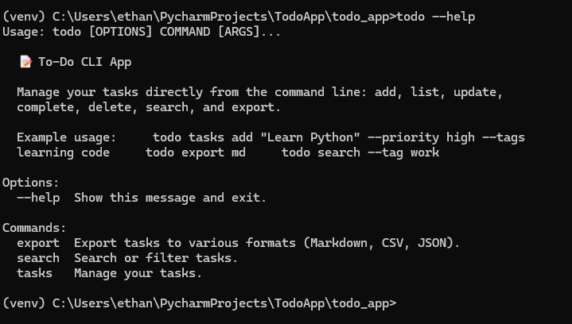

## 📋 Tasks Management
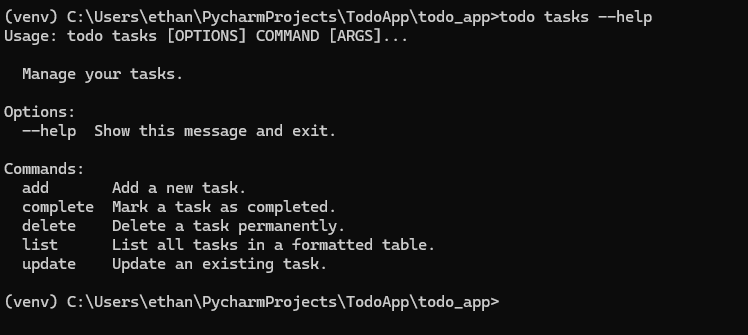
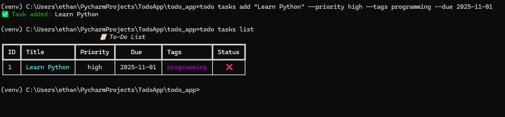
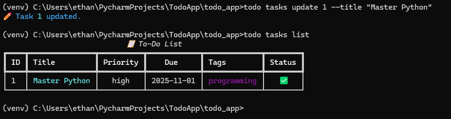
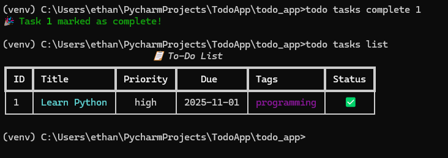
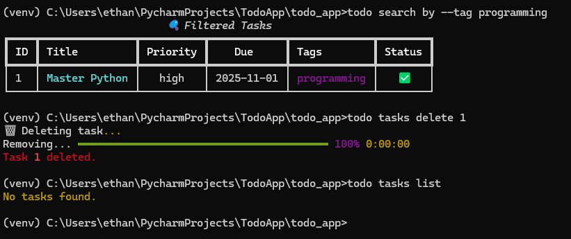

## 🔍 Searching
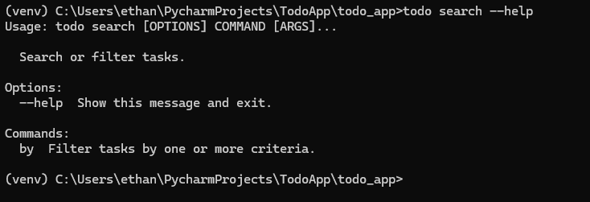
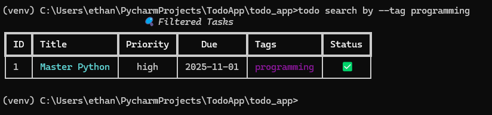  


## 📦 Exporting
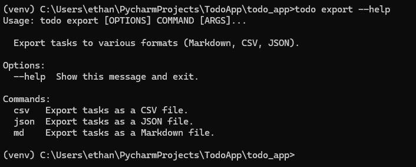
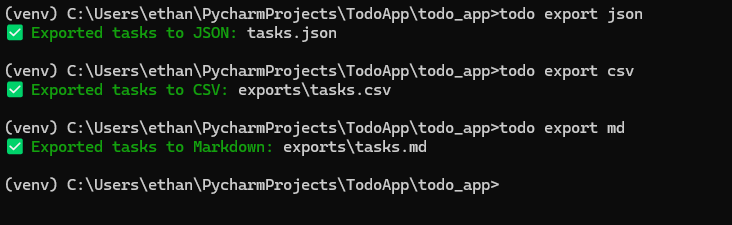
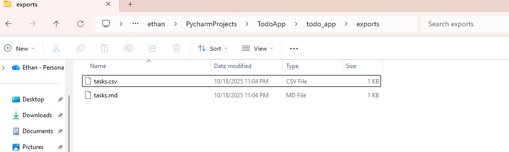


## 🗒️ Example Output (Rich Table)

Below is an example of how your To-Do list will look when displayed using **Rich** formatting in the terminal.

```text
🗒️ To-Do List
┏━━━━━━━━━━━━━━━━━━━━━━━━━━━━┳━━━━━━━━━━━━┳━━━━━━━━━━┳━━━━━━━━━━━━┳━━━━━━━━━━━━━━┳━━━━━━━┓
┃ ID                         ┃ Title      ┃ Priority ┃ Due        ┃ Tags         ┃ Done  ┃
┡━━━━━━━━━━━━━━━━━━━━━━━━━━━━╇━━━━━━━━━━━━╇━━━━━━━━━━╇━━━━━━━━━━━━╇━━━━━━━━━━━━━━╇━━━━━━━┩
│ 1                          │ Learn CLI  │ High     │ 2025-10-31 │ coding,python│ ❌     │
└────────────────────────────┴────────────┴──────────┴────────────┴──────────────┴───────┘
```  

## 💻 Author

Ethan Parrish

## 📜 License

MIT License © 2025 Ethan Parrish